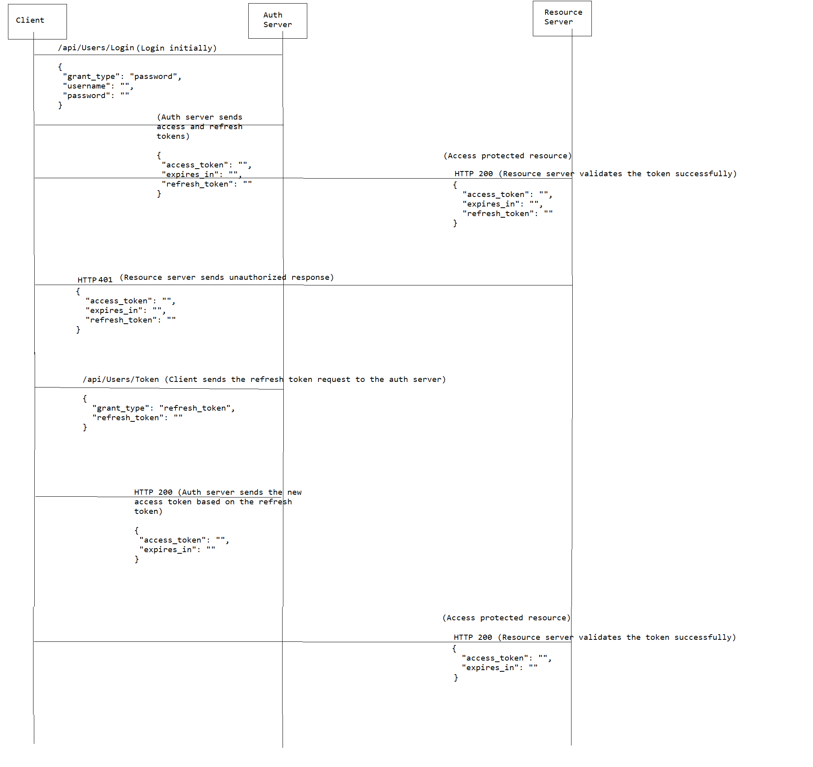

# Security techniques in .NET

## Table of Contents  
- [Cryptography 101](#cryptography-101)
    - [Hashing](#hashing)
    - [Symmetric Key Encryption](#symmetric-key-encryption)
    - [Asymmetric Key Encryption](#Asymmetric-key-encryption)
- [Basic Authentication](#basic-authentication)
- [JWT Authentication](#jwt-authentication)
- [Policy Authorization](#policy-authorization)

## Cryptography 101

Cryptography in .NET can be done using hashing, encryption and decryption using symmetric and asymmetric key algorithms.

### **Hashing**

For hashing we can implement it using various algorithms like MD5, SHA1, SHA2 series, Bcrypt.

But MD5 and SHA1 are no longer considered safe now and best practice is to either use SHA-2 family (SHA256, SHA512, etc..) or Bcrypt.

This project implements hashing using [`SHA512`](./Hashing/Hashing/Models/ShaHasher.cs#L14-L25) and [`Bcrypt`](./Hashing/Hashing/Models/BcryptHasher.cs#L7-L13) using a common interface [`IHasher`](./Hashing/Hashing/Interfaces/IHasher.cs)

### **Symmetric Key Encryption**

For symmetric key encryption we use [`AES algorithm`](https://en.wikipedia.org/wiki/Advanced_Encryption_Standard) as its the industry standard for symmetric key encryption.

AES algorithm comes with 128, 256 bit key sizes. The bigger the key size is harder it is to brute force it.

We are using CBC mode in which the plain text is broken into blocks 
and encrypted. Each block is then encrypted separately with using IV for the first block and passing the next IV from the output of first block and so on.

[`SymmetricKeyEncryption`](./SymmetricKeyEncryption/SymmetricKeyEncryption/SymmetricKeyEncryption.cs) is a wrapper over .NET implementation of AES which then [encrypts](./SymmetricKeyEncryption/SymmetricKeyEncryption/SymmetricKeyEncryption.cs#L35-L42) and [decrypts](./SymmetricKeyEncryption/SymmetricKeyEncryption/SymmetricKeyEncryption.cs#L26-L33) respectively.

### **Asymmetric Key Encryption**

For Asymmetric key encryption we use [`RSA algorithm`](https://en.wikipedia.org/wiki/RSA_(cryptosystem)) as its the industry standard for symmetric key encryption.

RSA algorithm comes with 512, 1024, 2048, 3076 and 4096 bit key sizes. The bigger the key size is harder it is to brute force it.

We are using [`Pkcs1`](https://en.wikipedia.org/wiki/PKCS1) padding to prevent it against known [`vulnerabilities`](https://en.wikipedia.org/wiki/RSA_(cryptosystem)#Attacks_against_plain_RSA).

To generate a self-signed public-private key pair in PEM format, we use OpenSSL using GitBash -

Private key -
```shell
openssl genpkey -algorithm RSA -out private_key.pem -pkeyopt rsa_keygen_bits:4096
```

Public key -
```
openssl rsa -pubout -in private_key.pem -out public_key.pem
```

We then read the PEM files using new .NET 5 method [`ImportFromPem`](https://docs.microsoft.com/en-us/dotnet/api/system.security.cryptography.rsa.importfrompem) which expects a span of characters, for older .NET versions we can use the BouncyCastle library.

## Basic Authentication

Basic authentication expects us to pass the credentials in the authorization header in the format for every request.

```shell
Authorization: Basic base64(username:password)
```

If used under HTTPS its moderately secure, but if used in HTTP its very unsecure as we can intercept the request headers and attack.

If we don't provide the Authorization header then the server will return a [`WWW-authenticate header`](https://developer.mozilla.org/en-US/docs/Web/HTTP/Headers/WWW-Authenticate) back meaning us to authenticate.

In .NET core we can implement basic authentication by inheriting the [`AuthenticationHandler`](https://docs.microsoft.com/en-us/dotnet/api/microsoft.aspnetcore.authentication.authenticationhandler-1?view=aspnetcore-5.0) abstract class and [`overriding`](./BasicAuthentication/src/Api/Authentication/BasicAuthenticationHandler.cs#L39-L84) the [`HandleAuthenticateAsync`](https://docs.microsoft.com/en-us/dotnet/api/microsoft.aspnetcore.authentication.authenticationhandler-1.handleauthenticateasync?view=aspnetcore-5.0#Microsoft_AspNetCore_Authentication_AuthenticationHandler_1_HandleAuthenticateAsync) method.

Post doing that we should register it in the [`ConfigureServices`](./BasicAuthentication/src/Api/Startup.cs#L41-L43) method and adding the [`app.UseAuthentication()`](./BasicAuthentication/src/Api/Startup.cs#L57) middleware in the `Configure` method.

Schema for the user is -
```javascript
{
    "first_name": "John",
    "last_name": "Doe",
    "gender_abbreviation": "M",
    "date_of_birth": "1970-01-01T10:40:00",
    "phone": "1234567890",
    "username": "johndoe123",
    "email": "johndoe.123@email.com",
    "password": "1234567890",
    "compare_password": "1234567890"
}
```

Postman [`collection`](https://www.getpostman.com/collections/fdc42ec10f878e04c258) and [`environment variables`](./BasicAuthentication/Local.postman_environment.json) here.

## JWT Authentication

JWT authentication is a self-contained authentication protocol where the token is a base64 representation of a Javascript object which contains 3 parts seperated by a period (`.`)

1. Header -<br/>
The algorithm denotes the cryptographic algorithm used to sign the token and the [`key-id`](https://tools.ietf.org/html/rfc7515#section-4.1.4) (kid) if using rotational keys to sign the keys and an [`optional public key link`](https://datatracker.ietf.org/doc/html/rfc7515#section-4.1.2) (jku)

```javascript
{
  "alg": "RS512",
  "typ": "JWT"
}
```

2. Payload (Claims)-<br/>
The claim is a javascript object representation of important user identity information, these claims can be a set of [`public`](https://datatracker.ietf.org/doc/html/rfc7519#section-4) or even custom private claims too.

A sample claims object looks like below -

```javascript
{
  "jti": "d7fc1cb6-712b-4e4b-a984-57b6d8f1afd6",
  "id": "1",
  "sub": "johndoe123",
  "given_name": "John",
  "family_name": "Doe",
  "email": "johndoe.123@email.com",
  "birthdate": "1970-01-01",
  "nbf": 1622471522,
  "exp": 1622471822,
  "iss": "http://localhost:5000",
  "aud": "http://localhost:5001"
}
```

3. Signature-<br/>
The header and claims part is signed using the same cryptographic algorithm mentioned in the `alg` key in the header, this is done as a tamper-mechanism to detect if the token is modified midway or not.

The Auth server exposes the following endpoints -
* [`/api/Users/Register`](./JWTAuthentication/auth_server/src/Api/Controllers/UsersController.cs#L39-L52) to register the user
* [`/api/Users/Login`](./JWTAuthentication/auth_server/src/Api/Controllers/UsersController.cs#L54-L75) to login the user and generate the initial set of access token and refresh token
* [`/api/Users/Token`](./JWTAuthentication/auth_server/src/Api/Controllers/UsersController.cs#L77-L97) to refresh the access token using the refresh token sent
* [`/api/Users/Revoke`](./JWTAuthentication/auth_server/src/Api/Controllers/UsersController.cs#L99-L112) to revoke the refresh token
* [`/api/Users/Logout`](./JWTAuthentication/auth_server/src/Api/Controllers/UsersController.cs#L114-L126) to force logout and delete all persisted refresh tokens.

There are 2 pairs of RSA public private keys for signing tokens and validating them for access and refresh token respectively.

Below is the sequence diagram for the JWT authentication -


**Nuget packages referenced -**
```shell
AutoMapper.Extensions.Microsoft.DependencyInjection -> For Automapper .NET Core (API)
Microsoft.AspNetCore.Authentication.JwtBearer -> For JWT authentication middleware (API)
Microsoft.EntityFrameworkCore.Tools -> For managing migrations through package manager console (API)

Ardalis.Specification -> For implementing the specification pattern in .NET core (Core)
Ardalis.Specification.EntityFrameworkCore -> For adding EF core related specification helpers (Core)
EntityFrameworkCore.Exceptions.SqlServer -> For handling SQL Server exceptions (Core)

BCrypt.Net-Next -> For hashing passwords using BCrypt algorithm (Infrastructure)
Microsoft.EntityFrameworkCore.SqlServer -> For adding EF core helpers for SQL Server (Infrastructure)
System.IdentityModel.Tokens.Jwt -> Official library to managing generation and validation JSON Web Tokens in .NET (Infrastructure)
```

Postman [`collection`](https://www.getpostman.com/collections/d07212e1e222e93cea38) and [`environment variables`](./JWTAuthentication/Local.postman_environment.json).

# Policy Authorization

Authorization is the process of allowing access policies to resources.

In .NET we can use the simple role-based authorization or much more granular policy-based authorization.

A policy is composed of a handler and a requirement. The handler acts on the requirement to determine if access is valid or not.

To create a [`requirement`](./PolicyAuthorization/resource_server/src/Api/Authorization/Requirements/CastVoteRequirement.cs) in .NET core, simply implement `IAuthorizationRequirement` interface.

To handle the requirement we override the generic abstract class `AuthorizationHandler` passing the above created requirement as a type and override the [`HandleRequirementAsync`](./PolicyAuthorization/resource_server/src/Api/Authorization/Handlers/CastVoteHandler.cs#L18-L35) method.

After creating the requirements and the handlers, we simply [`register them`](./PolicyAuthorization/resource_server/src/Api/Startup.cs#L61-L71) in Startup.cs

Lastly we can [`decorate`](./PolicyAuthorization/resource_server/src/Api/Controllers/VotersController.cs#L14) the action methods in the controller using the `AuthorizeAttribute` by passing the policy name.

Postman [`collection`](https://www.getpostman.com/collections/30c9de093784ab204573) and [`environment variables`](./PolicyAuthorization/Local.postman_environment.json).